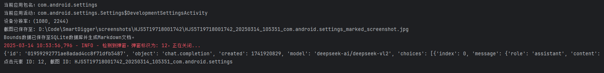
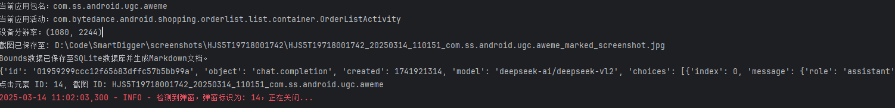

# SmartDigger 项目

## 项目简介

SmartDigger 是一个基于 Appium 及视觉大模型的智能移动应用测试工具。它能够自动检测应用界面中的弹窗，并智能处理各种弹窗场景，同时生成详细的元素边界数据报告，为移动应用测试提供高效、智能的解决方案。


## 功能特性

- **设备信息获取**：自动识别连接的 Android 设备，获取设备名称、分辨率等信息
- **界面元素分析**：实时截取应用界面，智能分析可点击元素及其边界信息
- **弹窗智能处理**：基于视觉大模型识别各类弹窗，自动执行关闭操作
- **数据报告生成**：自动记录元素边界信息，生成详细的 Markdown 格式报告
- **异常处理机制**：内置完善的错误处理机制，确保检测流程的稳定性

## 技术架构

SmartDigger 采用模块化设计，主要包含以下核心模块：

1. **设备管理模块**：通过 ADB 获取设备信息，包括设备名称、分辨率、当前应用包名等。
2. **界面分析模块**：基于 Appium 实现界面截图、元素边界提取及标注功能。
3. **弹窗处理模块**：结合视觉大模型和模板匹配技术，智能识别并处理弹窗。
4. **数据记录模块**：使用 SQLite 存储元素边界信息，并生成 Markdown 格式报告。
5. **API 服务模块**：提供 RESTful API 接口，支持远程调用诊断功能。

## API 接口说明

### 诊断接口

- **URL**: `/api/v1/diagnose`
- **Method**: `POST`
- **请求参数 (JSON)**:
    - `screenshot`: Base64 编码的手机屏幕截图
    - `xml_file`: XML层级结构文本
    - `devices_name`: 设备名称
- **返回结果**:
    - `msg`: 诊断结果消息
    - `script`: 生成的 ADB 点击脚本（如果诊断为弹窗）
- **状态**：
    - 200: 成功
    - 500: 失败

```json
{
  "msg": "视觉诊断为弹窗，跳过的坐标为：540,1805",
  "script": "import subprocess\n        subprocess.run(\n            ['adb', '-s', your_device_name, 'shell', 'input', 'tap', str(540), str(1805)],\n            check=True\n        )"
}
```

## 运行流程

1. **设备连接**：通过 ADB 连接 Android 设备，获取设备信息。
2. **界面截图**：使用 Appium 截取当前应用界面。
3. **元素分析**：解析界面 XML 结构，提取元素边界信息。
4. **弹窗检测**：调用视觉大模型进行弹窗检测，识别关闭按钮。
5. **数据处理**：将元素边界信息存储到数据库，并生成报告。
6. **异常处理**：自动处理检测过程中的异常情况，确保流程稳定运行。

## 环境要求

- Python 3.8+
- Appium Server 1.22.0+
- Android 设备或模拟器（Android 8.0+）
- 视觉大模型 API 访问权限

## 注意事项

1. 确保设备已开启开发者模式并授权 ADB 调试。
2. 配置正确的 Appium 服务器地址和设备信息。
3. 视觉大模型 API 需要有效的 API Key，请确保环境变量配置正确。
4. 截图目录和数据库路径可根据实际需求在 `.env` 文件中配置。

## 运行效果

### Case 1

系统

- 截图标注
  

- 运行日志
  

### Case 2

抖音

- 截图标注
  

- 运行日志
  

### 弹窗模版


