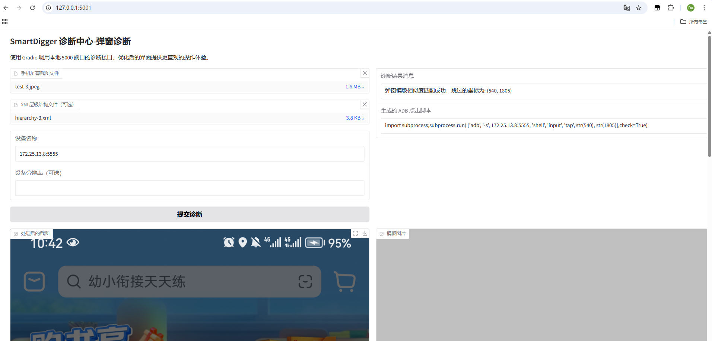

# SmartDigger 项目

## 项目简介

SmartDigger 是一个基于 Appium 及视觉大模型的智能移动应用测试工具。它能够自动检测应用界面中的弹窗，并智能处理各种弹窗场景，同时生成详细的元素边界数据报告，为移动应用测试提供高效、智能的解决方案。

## 功能特性

- **设备信息获取**：自动识别连接的 Android 设备，获取设备名称、分辨率等信息
- **界面元素分析**：实时截取应用界面，智能分析可点击元素及其边界信息
- **弹窗智能处理**：基于视觉大模型识别各类弹窗，自动执行关闭操作
- **数据报告生成**：自动记录元素边界信息，生成详细的 Markdown 格式报告
- **异常处理机制**：内置完善的错误处理机制，确保检测流程的稳定性

## 环境要求

- Python 3.8+
- Appium Server 1.22.0+
- Android 设备或模拟器（Android 8.0+）
- 视觉大模型 API 访问权限

## 运行效果

### Case 1
系统
- 截图标注
  

- 运行日志
  

### Case 2
抖音
- 截图标注
  

- 运行日志
  

## 参考

- [mobile_agent](https://github.com/QwenLM/Qwen2.5-VL/blob/main/cookbooks/mobile_agent.ipynb)
- [browser_use 最强基于Python的AI浏览器自动化](https://mp.weixin.qq.com/s/7NQO4Yd0AANaReKrhk3SXg)