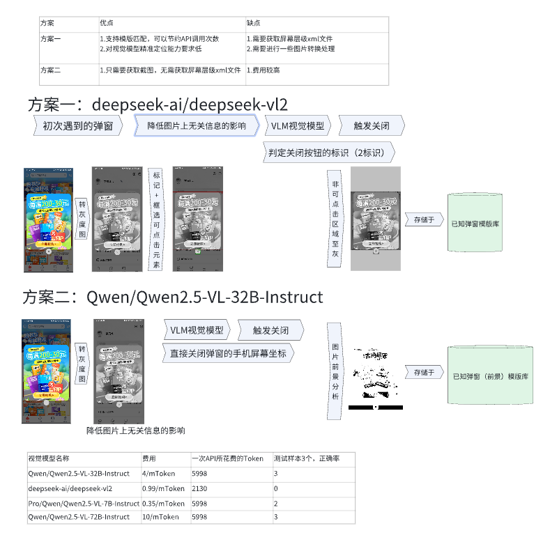
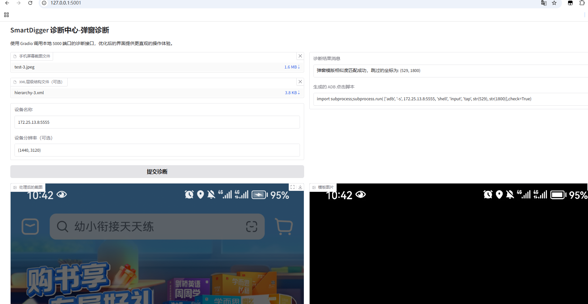

# SmartDigger 项目

## 初衷

SmartDigger 是一个基于视觉大模型的智能移动应用自动化任务执行异常的诊断中心，

- 诊断支持：
  目前支持突然弹窗的弹窗，自动识别弹窗的关闭按钮，并执行关闭操作

## 弹窗诊断流程



## 如何部署及 WebUI 示例启动

- 复制.env.sample 为 .env 文件，并修改参数`VISION_MODEL_API_KEY`参数为你的 硅基流动 API Key
- 执行 python api_run.py 启动服务
- 执行 python web_run.py 启动 WebUI
- 访问 http://127.0.0.1:5001
- 上传手机屏幕截图，上传 XML层级结构文本(可选),，点击诊断按钮

## API 接口说明

### 诊断接口

- **URL**: `/api/v1/diagnose`
- **Method**: `POST`
- **请求参数 (JSON)**:
    - `screenshot`: Base64 编码的手机屏幕截图
    - `xml_file`: "string"  XML层级结构文本(可选) 这个参数有值则走-方案一逻辑
    - `devices_name`: "string"  设备名称
    - `resolution`: "(100,200)"  设备分辨率`(可选) 这个参数有值则走-方案二逻辑
- **返回结果**:
    - `msg`: 诊断结果消息
    - `script`: 生成的 ADB 点击脚本（如果诊断为弹窗）
    - `template_fie`: 匹配或新增的模版弹窗
- **状态**：
    - 200: 成功
    - 500: 失败

### 返回示例

```json
{
  "msg": "视觉诊断为弹窗，跳过的坐标为：540,1805",
  "script": "import subprocess;subprocess.run( ['adb', '-s', 172.25.13.8:5555, 'shell', 'input', 'tap', str(540), str(1805)],check=True)"
}
```

### 部署脚本

```shell
# 部署脚本
nohup sh deploy.sh > logs/run.log 2>&1 &
# 查看python进程
ps aux |grep python
# 停止python进程
kill -9 pid
```

## 性能

### 初次弹窗：响应时间 3s


### 模版库匹配：响应时间 1s


## 视觉模型花费

#### 单次 API 调用模型：toal_tokens:2080


#### 截至目前调用 209719 Token(s) 话费：0.2076 元，估计调用快 100 次 api


## 运行效果

### 方案一


### 方案二




